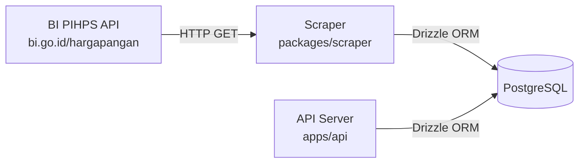
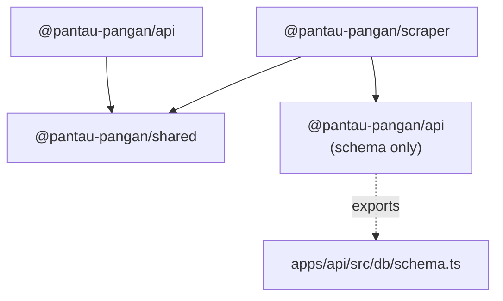
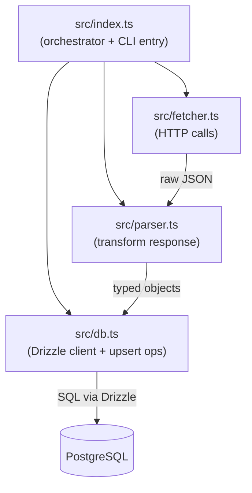
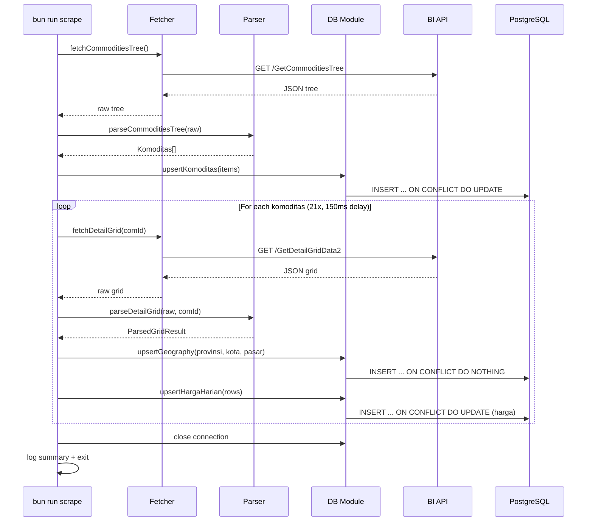

# Design Document — M2 Scraper

## Overview

M2 Scraper mengimplementasikan pipeline data dari API publik Bank Indonesia PIHPS ke PostgreSQL. Milestone ini mencakup:

1. **Database layer** — Drizzle ORM schema (6 tabel), koneksi via `postgres` (postgres.js), dan migration setup
2. **Shared package** — Types, constants, dan utility functions yang dipakai lintas package
3. **Scraper package** — Fetcher (HTTP ke BI), Parser (transform response), dan Orchestrator (koordinasi + upsert ke DB)

Scraper berjalan sebagai standalone CLI process (`bun run scrape`) yang idempotent — bisa dijalankan ulang tanpa duplikasi data berkat upsert strategy dengan `UNIQUE NULLS NOT DISTINCT`.

### Keputusan Desain Utama

| Keputusan       | Pilihan                                      | Alasan                                                       |
| --------------- | -------------------------------------------- | ------------------------------------------------------------ |
| DB driver       | `postgres` (postgres.js)                     | Lightweight, native ESM, works great with Bun                |
| Schema location | `apps/api/src/db/schema.ts`                  | Drizzle convention; scraper imports via workspace dependency |
| HTTP library    | Bun native `fetch()`                         | Zero-dep, sudah cukup untuk public API tanpa auth            |
| Retry strategy  | 3 attempts, exponential backoff              | Toleransi terhadap transient network errors                  |
| Upsert strategy | `onConflictDoUpdate` / `onConflictDoNothing` | Idempotent writes, safe untuk re-run                         |
| Cron (M2 scope) | Manual CLI only                              | Cron scheduling di API server ditambahkan minimal            |

---

## Architecture

### System Context



### Package Dependencies



### Scraper Internal Architecture



### Execution Flow



---

## Components and Interfaces

### 1. Database Schema (`apps/api/src/db/schema.ts`)

Mendefinisikan 6 tabel menggunakan Drizzle `pg-core`:

```typescript
import {
  pgTable,
  serial,
  varchar,
  integer,
  smallint,
  numeric,
  date,
  text,
  timestamp,
  unique,
  check,
  index,
} from 'drizzle-orm/pg-core'
import { sql } from 'drizzle-orm'

// komoditas — master data 21 komoditas BI
export const komoditas = pgTable('komoditas', {
  id: serial('id').primaryKey(),
  treeId: varchar('tree_id', { length: 10 }).notNull(),
  comId: integer('com_id').notNull().unique(),
  nama: varchar('nama', { length: 100 }).notNull(),
  kategori: varchar('kategori', { length: 50 }).notNull(),
  satuan: varchar('satuan', { length: 20 }).default('kg'),
  createdAt: timestamp('created_at', { withTimezone: true }).notNull().defaultNow(),
  updatedAt: timestamp('updated_at', { withTimezone: true }).notNull().defaultNow(),
})

// provinsi — 34 provinsi dari BI
export const provinsi = pgTable('provinsi', {
  id: serial('id').primaryKey(),
  biId: integer('bi_id').notNull().unique(),
  nama: varchar('nama', { length: 100 }).notNull().unique(),
  createdAt: timestamp('created_at', { withTimezone: true }).notNull().defaultNow(),
})

// kota — kota/kabupaten, FK ke provinsi
export const kota = pgTable(
  'kota',
  {
    id: serial('id').primaryKey(),
    provinsiId: integer('provinsi_id')
      .notNull()
      .references(() => provinsi.id),
    nama: varchar('nama', { length: 100 }).notNull(),
    createdAt: timestamp('created_at', { withTimezone: true }).notNull().defaultNow(),
  },
  (t) => [unique('kota_provinsi_nama_uniq').on(t.provinsiId, t.nama)],
)

// pasar — pasar tradisional, FK ke kota
export const pasar = pgTable(
  'pasar',
  {
    id: serial('id').primaryKey(),
    kotaId: integer('kota_id')
      .notNull()
      .references(() => kota.id),
    nama: varchar('nama', { length: 100 }).notNull(),
    createdAt: timestamp('created_at', { withTimezone: true }).notNull().defaultNow(),
  },
  (t) => [unique('pasar_kota_nama_uniq').on(t.kotaId, t.nama)],
)

// harga_harian — fact table semua level (0-3)
export const hargaHarian = pgTable(
  'harga_harian',
  {
    id: serial('id').primaryKey(),
    komoditasId: integer('komoditas_id')
      .notNull()
      .references(() => komoditas.id),
    level: smallint('level').notNull(),
    provinsiId: integer('provinsi_id').references(() => provinsi.id),
    kotaId: integer('kota_id').references(() => kota.id),
    pasarId: integer('pasar_id').references(() => pasar.id),
    harga: numeric('harga', { precision: 12, scale: 2 }).notNull(),
    tanggal: date('tanggal').notNull(),
    createdAt: timestamp('created_at', { withTimezone: true }).notNull().defaultNow(),
  },
  (t) => [
    check(
      'chk_level_fk',
      sql`
    (level = 0 AND provinsi_id IS NULL AND kota_id IS NULL AND pasar_id IS NULL) OR
    (level = 1 AND provinsi_id IS NOT NULL AND kota_id IS NULL AND pasar_id IS NULL) OR
    (level = 2 AND provinsi_id IS NOT NULL AND kota_id IS NOT NULL AND pasar_id IS NULL) OR
    (level = 3 AND provinsi_id IS NOT NULL AND kota_id IS NOT NULL AND pasar_id IS NOT NULL)
  `,
    ),
    unique('harga_harian_upsert_uniq')
      .on(t.komoditasId, t.level, t.provinsiId, t.kotaId, t.pasarId, t.tanggal)
      .nullsNotDistinct(),
    index('idx_harga_komoditas_level_tanggal').on(t.komoditasId, t.level, t.tanggal),
    index('idx_harga_komoditas_level_prov_tanggal')
      .on(t.komoditasId, t.level, t.provinsiId, t.tanggal)
      .where(sql`level >= 1`),
  ],
)

// insight_cache — LLM response cache
export const insightCache = pgTable(
  'insight_cache',
  {
    id: serial('id').primaryKey(),
    komoditasId: integer('komoditas_id')
      .notNull()
      .references(() => komoditas.id),
    provinsiId: integer('provinsi_id').references(() => provinsi.id),
    cacheDate: date('cache_date').notNull(),
    insight: text('insight').notNull(),
    generatedAt: timestamp('generated_at', { withTimezone: true }).notNull().defaultNow(),
  },
  (t) => [
    unique('insight_cache_upsert_uniq')
      .on(t.komoditasId, t.provinsiId, t.cacheDate)
      .nullsNotDistinct(),
    index('idx_insight_lookup').on(t.komoditasId, t.provinsiId, t.cacheDate),
  ],
)
```

### 2. Database Connection (`apps/api/src/db/index.ts`)

```typescript
import { drizzle } from 'drizzle-orm/postgres-js'
import postgres from 'postgres'
import * as schema from './schema'

const connectionString = process.env.DATABASE_URL
if (!connectionString) {
  throw new Error('DATABASE_URL environment variable is required')
}

const client = postgres(connectionString)
export const db = drizzle(client, { schema })
export { schema }
```

### 3. Drizzle Config (`apps/api/drizzle.config.ts`)

```typescript
import { defineConfig } from 'drizzle-kit'

export default defineConfig({
  schema: './src/db/schema.ts',
  out: './drizzle',
  dialect: 'postgresql',
  dbCredentials: {
    url: process.env.DATABASE_URL!,
  },
})
```

### 4. Fetcher (`packages/scraper/src/fetcher.ts`)

```typescript
import { BI_BASE_URL, PRICE_TYPE_ID, IS_PASOKAN } from '@pantau-pangan/shared'

interface FetchOptions {
  maxRetries?: number // default 3
  courtesyDelay?: number // default 150ms
}

export async function fetchCommoditiesTree(): Promise<unknown>
export async function fetchDetailGrid(comId: number, provId?: number): Promise<unknown>

// Internal: retry with exponential backoff (1s, 2s, 4s)
async function fetchWithRetry(url: string, retries: number): Promise<Response>
```

### 5. Parser (`packages/scraper/src/parser.ts`)

```typescript
import type { BiCommodityTreeNode, BiDetailGridRow } from '@pantau-pangan/shared'

export interface ParsedKomoditas {
  treeId: string
  comId: number
  nama: string
  kategori: string
}

export interface ParsedGridRow {
  level: number
  id: number
  name: string
  category: string
  prices: Array<{ tanggal: Date; harga: number }>
}

export interface ParsedGridResult {
  rows: ParsedGridRow[]
  dateKeys: string[]
}

export function parseCommoditiesTree(raw: unknown): ParsedKomoditas[]
export function parseDetailGrid(raw: unknown, comId: number): ParsedGridResult
```

### 6. Scraper DB Module (`packages/scraper/src/db.ts`)

```typescript
import { drizzle } from 'drizzle-orm/postgres-js'
import postgres from 'postgres'
import * as schema from '@pantau-pangan/api/src/db/schema'

export function createScraperDb(databaseUrl: string): {
  db: ReturnType<typeof drizzle>
  close: () => Promise<void>
}

export async function upsertKomoditas(db, items: ParsedKomoditas[]): Promise<number>
export async function upsertProvinsi(db, rows: ParsedGridRow[]): Promise<Map<string, number>>
export async function upsertKota(
  db,
  rows: ParsedGridRow[],
  provinsiMap,
): Promise<Map<string, number>>
export async function upsertPasar(db, rows: ParsedGridRow[], kotaMap): Promise<Map<string, number>>
export async function upsertHargaHarian(
  db,
  rows: ParsedGridRow[],
  komoditasId,
  maps,
): Promise<number>
```

### 7. Orchestrator (`packages/scraper/src/index.ts`)

```typescript
async function main(): Promise<void> {
  // 1. Connect to DB
  // 2. Fetch + parse + upsert komoditas
  // 3. For each komoditas: fetch grid → parse → upsert geo → upsert harga
  // 4. Log summary
  // 5. Close DB + exit
}
```

### 8. Shared Package Types (`packages/shared/src/types.ts`)

```typescript
// Database entity types
export interface Komoditas {
  id: number
  treeId: string
  comId: number
  nama: string
  kategori: string
  satuan: string
}
export interface Provinsi {
  id: number
  biId: number
  nama: string
}
export interface Kota {
  id: number
  provinsiId: number
  nama: string
}
export interface Pasar {
  id: number
  kotaId: number
  nama: string
}
export interface HargaHarian {
  id: number
  komoditasId: number
  level: number
  provinsiId: number | null
  kotaId: number | null
  pasarId: number | null
  harga: number
  tanggal: string
}

// BI API response types
export interface BiCommodityTreeNode {
  id: string
  text: string
  expanded?: boolean
  items?: BiCommodityTreeLeaf[]
}
export interface BiCommodityTreeLeaf {
  id: string
  text: string
  comId: number
}
export interface BiDetailGridRow {
  id: number
  name: string
  category: string
  level: number
  [dateKey: string]: unknown
}

// Computed types
export type Timeframe = '1D' | '1W' | '1M' | '3M' | '1Y'
export interface BubbleData {
  komoditasId: number
  nama: string
  kategori: string
  harga: number
  perubahan: number
  radius: number
  color: string
}
export interface InsightResponse {
  komoditasId: number
  provinsiId: number | null
  insight: string
  generatedAt: string
  cached: boolean
}
```

### 9. Shared Package Constants (`packages/shared/src/constants.ts`)

```typescript
export const BI_BASE_URL = 'https://www.bi.go.id/hargapangan/WebSite/Home'
export const PRICE_TYPE_ID = 1
export const IS_PASOKAN = 1

export type Timeframe = '1D' | '1W' | '1M' | '3M' | '1Y'

export const VOLATILITY_THRESHOLDS: Record<Timeframe, { stable: number; significant: number }> = {
  '1D': { stable: 0.5, significant: 2 },
  '1W': { stable: 2, significant: 5 },
  '1M': { stable: 5, significant: 10 },
  '3M': { stable: 10, significant: 20 },
  '1Y': { stable: 15, significant: 30 },
}

export const TIMEFRAME_DAYS: Record<Timeframe, number> = {
  '1D': 1,
  '1W': 7,
  '1M': 30,
  '3M': 90,
  '1Y': 365,
}
export const BUBBLE_MIN_RADIUS = 30
export const BUBBLE_MAX_RADIUS = 120
```

### 10. Shared Package Utils (`packages/shared/src/utils.ts`)

```typescript
import {
  VOLATILITY_THRESHOLDS,
  BUBBLE_MIN_RADIUS,
  BUBBLE_MAX_RADIUS,
  type Timeframe,
} from './constants'

export function hitungPerubahan(hargaSekarang: number, hargaTarget: number): number {
  return ((hargaSekarang - hargaTarget) / hargaTarget) * 100
}

export function getBubbleColor(persen: number, timeframe: Timeframe): string {
  const { stable, significant } = VOLATILITY_THRESHOLDS[timeframe]
  if (Math.abs(persen) < stable / 5) return '#6b7280'
  if (persen >= significant) return '#ef4444'
  if (persen > 0) return '#f97316'
  if (persen <= -significant) return '#22c55e'
  return '#84cc16'
}

export function getBubbleRadius(persen: number, timeframe: Timeframe): number {
  const { significant } = VOLATILITY_THRESHOLDS[timeframe]
  const ratio = Math.min(Math.abs(persen) / significant, 1)
  return BUBBLE_MIN_RADIUS + ratio * (BUBBLE_MAX_RADIUS - BUBBLE_MIN_RADIUS)
}

export function parseDateKeys(row: Record<string, unknown>): string[] {
  return Object.keys(row)
    .filter((k) => /^\d{2}\/\d{2}\/\d{4}$/.test(k))
    .sort()
}
```

---

## Data Models

### BI API Response Models

**GetCommoditiesTree Response:**

```json
[
  {
    "id": "1",
    "text": "Beras",
    "expanded": true,
    "items": [{ "id": "1_1", "text": "Beras Kualitas Bawah I", "comId": 1 }]
  }
]
```

**GetDetailGridData2 Response:**

```json
{
  "data": [
    {
      "id": 0,
      "name": "Semua Provinsi",
      "category": "0",
      "level": 0,
      "18/05/2026": 48350.0,
      "19/05/2026": 47800.0
    }
  ]
}
```

### Internal Data Flow

```
BI Raw Response → Parser → Internal Types → DB Module → PostgreSQL
```

| Stage       | Type                 | Description                                     |
| ----------- | -------------------- | ----------------------------------------------- |
| Raw tree    | `unknown`            | Unvalidated JSON from GetCommoditiesTree        |
| Parsed tree | `ParsedKomoditas[]`  | Validated leaf nodes with comId, nama, kategori |
| Raw grid    | `unknown`            | Unvalidated JSON from GetDetailGridData2        |
| Parsed grid | `ParsedGridResult`   | Rows with level, location, date-price pairs     |
| DB entities | Drizzle insert types | Ready for upsert operations                     |

### Upsert Strategy per Table

| Table           | Conflict Target                                                                     | Action                            |
| --------------- | ----------------------------------------------------------------------------------- | --------------------------------- |
| `komoditas`     | `com_id`                                                                            | UPDATE nama, kategori, updated_at |
| `provinsi`      | `bi_id`                                                                             | DO NOTHING (nama stabil)          |
| `kota`          | `(provinsi_id, nama)`                                                               | DO NOTHING                        |
| `pasar`         | `(kota_id, nama)`                                                                   | DO NOTHING                        |
| `harga_harian`  | `(komoditas_id, level, provinsi_id, kota_id, pasar_id, tanggal)` NULLS NOT DISTINCT | UPDATE harga                      |
| `insight_cache` | `(komoditas_id, provinsi_id, cache_date)` NULLS NOT DISTINCT                        | UPDATE insight, generated_at      |

### Geographic Entity Resolution

Saat parsing `GetDetailGridData2`, scraper perlu me-resolve nama lokasi ke database ID:

1. **Level 1 (provinsi)**: `row.id` = `bi_id` → lookup/insert provinsi → get `provinsi.id`
2. **Level 2 (kota)**: `row.category` = nama provinsi → resolve `provinsi_id`, then lookup/insert kota by `(provinsi_id, row.name)` → get `kota.id`
3. **Level 3 (pasar)**: `row.category` = nama kota → resolve `kota_id`, then lookup/insert pasar by `(kota_id, row.name)` → get `pasar.id`

Scraper maintains in-memory maps selama satu run:

- `provinsiMap: Map<string, number>` — nama → id
- `kotaMap: Map<string, number>` — `${provinsiNama}|${kotaNama}` → id
- `pasarMap: Map<string, number>` — `${kotaNama}|${pasarNama}` → id

---

## Correctness Properties

_A property is a characteristic or behavior that should hold true across all valid executions of a system — essentially, a formal statement about what the system should do. Properties serve as the bridge between human-readable specifications and machine-verifiable correctness guarantees._

### Property 1: Percentage Change Formula

_For any_ two positive numbers `hargaSekarang` and `hargaTarget`, `hitungPerubahan(hargaSekarang, hargaTarget)` SHALL equal `((hargaSekarang - hargaTarget) / hargaTarget) * 100` within floating-point precision.

**Validates: Requirements 5.1**

### Property 2: Bubble Color Threshold Consistency

_For any_ percentage value and any valid timeframe, `getBubbleColor(persen, timeframe)` SHALL return exactly one of the 5 defined hex colors, and the returned color SHALL be consistent with the VOLATILITY_THRESHOLDS boundaries for that timeframe (i.e., if `|persen| < stable/5` → gray, if `persen >= significant` → red, etc.).

**Validates: Requirements 5.2**

### Property 3: Bubble Radius Bounded Output

_For any_ percentage value and any valid timeframe, `getBubbleRadius(persen, timeframe)` SHALL return a value in the range `[BUBBLE_MIN_RADIUS, BUBBLE_MAX_RADIUS]` (i.e., `[30, 120]`), and the radius SHALL be monotonically non-decreasing with respect to `|persen|`.

**Validates: Requirements 5.3**

### Property 4: Date Key Filtering and Sorting

_For any_ object with a mix of keys (some matching `DD/MM/YYYY` pattern, some not), `parseDateKeys(obj)` SHALL return only keys matching the date pattern, and the returned array SHALL be sorted in ascending lexicographic order (which equals chronological order for this format).

**Validates: Requirements 5.4**

### Property 5: Commodities Tree Leaf Extraction

_For any_ valid tree structure (array of category nodes with leaf items), `parseCommoditiesTree(tree)` SHALL return exactly one `ParsedKomoditas` entry per leaf node, with `comId` matching the leaf's `comId`, `nama` matching the leaf's `text`, and `kategori` matching the parent node's `text`.

**Validates: Requirements 7.1**

### Property 6: Detail Grid Structure Preservation

_For any_ valid grid response (object with `data` array containing rows with level, id, name, category, and date keys), `parseDetailGrid(raw, comId)` SHALL return a `ParsedGridResult` where each row preserves the original level, name, and category, and the `prices` array contains exactly the date-price pairs from the dynamic date keys.

**Validates: Requirements 7.2**

### Property 7: Parser Error Signaling

_For any_ malformed input (missing `data` field, non-array `data`, rows missing `level`/`name`/`category` fields), the parser functions SHALL throw an Error with a message that identifies the specific structural problem.

**Validates: Requirements 7.4**

### Property 8: Level-to-FK Mapping Correctness

_For any_ parsed grid row with a level in {0, 1, 2, 3}, the generated `harga_harian` insert object SHALL have `provinsi_id = null` when level = 0, `kota_id = null` when level ≤ 1, and `pasar_id = null` when level ≤ 2. Conversely, the non-null FK fields SHALL be populated for their respective levels.

**Validates: Requirements 8.7**

---

## Error Handling

### Fetcher Errors

| Scenario                      | Handling                                                                      |
| ----------------------------- | ----------------------------------------------------------------------------- |
| Network timeout / DNS failure | Retry up to 3x with exponential backoff (1s, 2s, 4s). Throw after exhaustion. |
| HTTP 4xx/5xx                  | Retry (BI sometimes returns 500 transiently). Throw after 3 attempts.         |
| Invalid JSON response         | Throw immediately (no retry — indicates API change).                          |

### Parser Errors

| Scenario                                  | Handling                                         |
| ----------------------------------------- | ------------------------------------------------ |
| Missing `data` field in grid response     | Throw `ParseError` with field name               |
| Leaf node without `comId`                 | Skip node, log warning                           |
| Row without required fields (level, name) | Throw `ParseError` identifying the row           |
| No date keys found in response            | Throw `ParseError` — indicates API format change |

### Orchestrator Error Strategy

```
Per-komoditas error isolation:
├── If fetchDetailGrid fails after retries → log error, continue to next komoditas
├── If parseDetailGrid fails → log error, continue to next komoditas
├── If DB upsert fails → log error, continue to next komoditas
└── If ALL 21 komoditas fail → exit code 1

Global errors (fail fast):
├── DATABASE_URL not set → throw at startup
├── fetchCommoditiesTree fails → exit code 1 (can't proceed without master data)
└── DB connection fails → exit code 1
```

### Database Constraint Violations

| Constraint                          | Expected Behavior                                                                  |
| ----------------------------------- | ---------------------------------------------------------------------------------- |
| `chk_level_fk` violation            | Bug in FK mapping logic — should never happen if Property 8 holds. Log + skip row. |
| UNIQUE violation (non-upsert path)  | Should not occur — all writes use upsert. If it does, log + skip.                  |
| FK reference to non-existent entity | Process geographic entities before harga_harian. If still fails, log + skip row.   |

---

## Testing Strategy

### Approach

Testing M2 menggunakan **dual approach**:

- **Property-based tests** (via `fast-check`) untuk pure functions di shared package dan parser
- **Unit tests** (via `bun:test`) untuk specific examples, integration points, dan error conditions

### Property-Based Testing Setup

- Library: **fast-check** (mature, well-maintained, works with Bun test runner)
- Minimum iterations: **100 per property**
- Tag format: `Feature: m2-scraper, Property N: {title}`

### Test File Structure

```
packages/shared/src/__tests__/
├── utils.property.test.ts    — Properties 1, 2, 3, 4
└── utils.test.ts             — Unit tests for edge cases

packages/scraper/src/__tests__/
├── parser.property.test.ts   — Properties 5, 6, 7
├── parser.test.ts            — Unit tests for specific BI response examples
├── db.property.test.ts       — Property 8
├── fetcher.test.ts           — Unit tests with mocked fetch
└── index.test.ts             — Orchestrator integration tests
```

### Property Test Configuration

Setiap property test harus:

1. Run minimum 100 iterations (`fc.assert(property, { numRuns: 100 })`)
2. Include comment referencing design property number
3. Use custom arbitraries that generate realistic BI-like data

### Unit Test Coverage

Unit tests fokus pada:

- Specific BI API response examples (dari `docs/api-reference.md`)
- Edge cases: empty responses, single row, maximum date keys
- Error conditions: malformed JSON, missing fields, network failures
- Integration: orchestrator flow with mocked dependencies

### Test Commands

```bash
# Run all tests
bun test

# Run specific package tests
bun test --filter packages/shared
bun test --filter packages/scraper

# Run only property tests
bun test --filter "*.property.test.ts"
```
