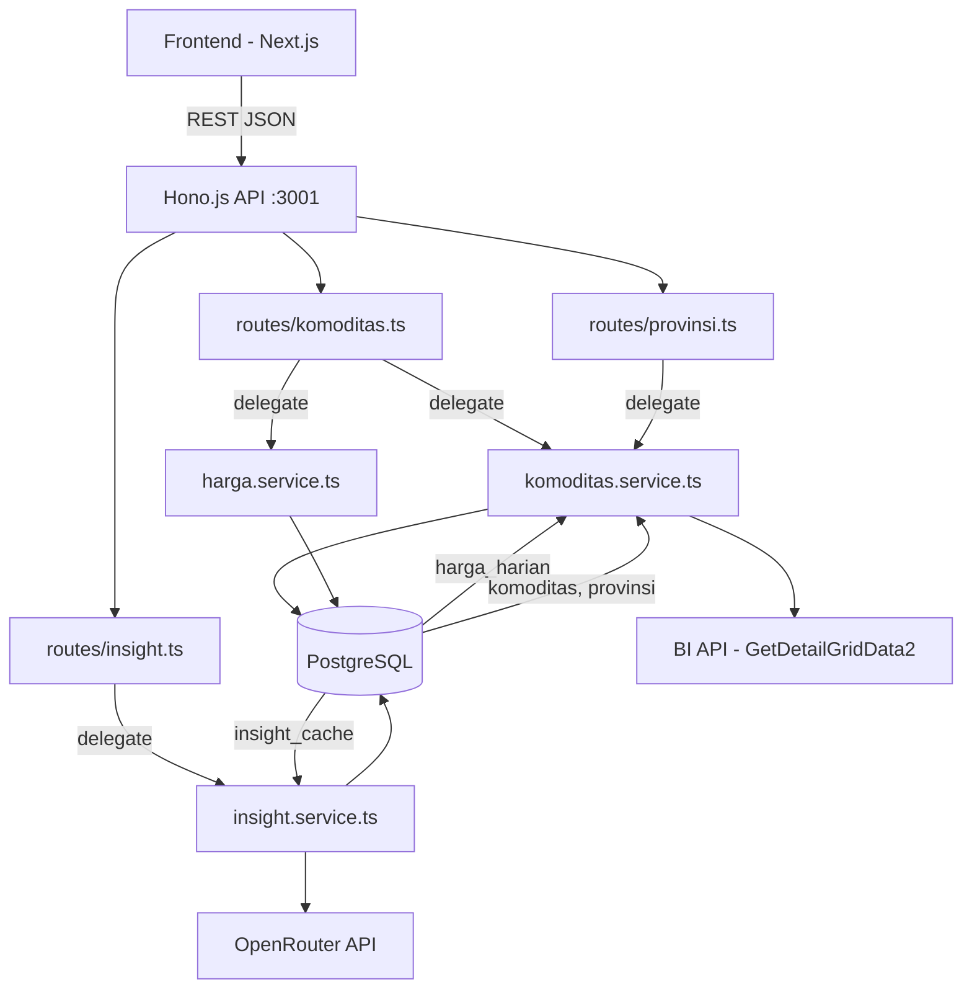
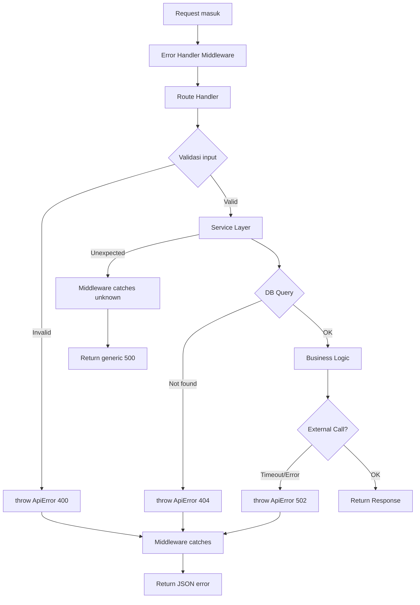

# Dokumen Design — M3 API

## Overview

M3 API adalah REST layer yang dibangun di atas Hono.js 4.x + Bun runtime, menyediakan 5 endpoint utama untuk frontend bubble chart. API ini menjembatani data harga pangan yang terakumulasi di PostgreSQL (hasil scraper M2) dengan visualisasi D3.js di frontend (M4+).

Arsitektur mengikuti pola **thin route handler** — route hanya parsing request dan delegasi ke service layer. Service function menerima parameter primitif (bukan objek Hono), sehingga bisa langsung di-wrap ke tRPC procedure saat migrasi V2 tanpa refactor.

### Keputusan Arsitektur Utama

| Keputusan                     | Alasan                                                                |
| ----------------------------- | --------------------------------------------------------------------- |
| Hono.js 4.x di Bun            | Lightweight, type-safe, performa tinggi — sudah dipilih di M1         |
| Drizzle ORM untuk semua query | Type-safe, syntax mirip SQL, support Bun                              |
| Route → Service separation    | Migrasi V2 tRPC = wrap service function ke procedure (~5 menit/route) |
| Service terima primitif       | Decoupled dari framework HTTP — testable dan reusable                 |
| OpenRouter untuk LLM          | Provider V1, murah untuk eksperimen                                   |
| Cache insight per hari WIB    | TTL natural — data harga update harian                                |
| Proxy `/detail` ke BI live    | Data 5 hari terakhir selalu fresh, tidak perlu cache                  |

---

## Architecture

### Diagram Arsitektur



### Request Flow

```
Client Request
    │
    ▼
┌─────────────────────────────────┐
│  Hono Middleware                │
│  - Error handler (global)       │
│  - Content-Type: application/json│
└─────────────────────────────────┘
    │
    ▼
┌─────────────────────────────────┐
│  Route Handler (thin)           │
│  1. Parse path params           │
│  2. Parse query params          │
│  3. Validate input              │
│  4. Call service function        │
│  5. Return c.json(result)       │
└─────────────────────────────────┘
    │
    ▼
┌─────────────────────────────────┐
│  Service Layer                  │
│  - Receives primitives only     │
│  - Contains all business logic  │
│  - Uses Drizzle for DB queries  │
│  - Makes external HTTP calls    │
└─────────────────────────────────┘
    │
    ▼
┌─────────────────────────────────┐
│  Data Layer                     │
│  - PostgreSQL via Drizzle       │
│  - BI API via fetch             │
│  - OpenRouter via fetch         │
└─────────────────────────────────┘
```

---

## Components and Interfaces

### Struktur File/Folder

```
apps/api/src/
├── index.ts                    ← Entry point: create app, mount routes, export server
├── routes/
│   ├── komoditas.ts            ← GET /komoditas, /komoditas/:id/historis, /komoditas/:id/detail
│   ├── insight.ts              ← GET /komoditas/:id/insight
│   └── provinsi.ts            ← GET /provinsi
├── services/
│   ├── komoditas.service.ts   ← Logic: list komoditas, proxy BI detail
│   ├── harga.service.ts       ← Logic: historis harga, query timeframe
│   └── insight.service.ts     ← Logic: LLM call, cache management
├── middleware/
│   └── error-handler.ts       ← Global error handler middleware
├── lib/
│   └── validators.ts          ← Shared validation helpers (parseIntParam, validateTimeframe)
└── db/
    ├── schema.ts              ← Drizzle schema (sudah ada dari M2)
    └── index.ts               ← Drizzle client (sudah ada dari M2)
```

### Route Handlers

Setiap route handler mengikuti pola yang sama — maksimal 15 baris kode efektif:

```typescript
// routes/komoditas.ts
import { Hono } from 'hono'
import { getAllKomoditas } from '../services/komoditas.service'
import { getHistoris } from '../services/harga.service'
import { getDetail } from '../services/komoditas.service'
import { parseIntParam, validateTimeframe, validateProvinsiId } from '../lib/validators'

const app = new Hono()

// GET /komoditas
app.get('/', async (c) => {
  const timeframe = validateTimeframe(c.req.query('timeframe') ?? '1D')
  const provinsiId = validateProvinsiId(c.req.query('provinsiId') ?? '0')
  const data = await getAllKomoditas(provinsiId, timeframe)
  return c.json(data)
})

// GET /komoditas/:id/historis
app.get('/:id/historis', async (c) => {
  const id = parseIntParam(c.req.param('id'), 'id')
  const provinsiId = validateProvinsiId(c.req.query('provinsiId') ?? '0')
  const data = await getHistoris(id, provinsiId)
  return c.json(data)
})

// GET /komoditas/:id/detail
app.get('/:id/detail', async (c) => {
  const id = parseIntParam(c.req.param('id'), 'id')
  const provinsiId = validateProvinsiId(c.req.query('provinsiId') ?? '0')
  const data = await getDetail(id, provinsiId)
  return c.json(data)
})

export default app
```

### Service Function Signatures

```typescript
// services/komoditas.service.ts
import type { BubbleData } from '@pantau-pangan/shared'
import type { Timeframe } from '@pantau-pangan/shared'

/** List semua komoditas dengan harga terbaru + % perubahan + bubble data */
export async function getAllKomoditas(
  provinsiId: number,
  timeframe: Timeframe,
): Promise<BubbleData[]>

/** Proxy request ke BI API GetDetailGridData2 */
export async function getDetail(komoditasId: number, provinsiId: number): Promise<unknown>

/** List semua provinsi untuk dropdown filter */
export async function getProvinsiList(): Promise<
  Array<{
    id: number
    biId: number
    nama: string
  }>
>
```

```typescript
// services/harga.service.ts

/** Ambil historis harga untuk line chart, max 365 data points */
export async function getHistoris(
  komoditasId: number,
  provinsiId: number,
): Promise<Array<{ tanggal: string; harga: number }>>
```

```typescript
// services/insight.service.ts
import type { InsightResponse } from '@pantau-pangan/shared'

/** Get atau generate LLM insight dengan cache-first strategy */
export async function getInsight(komoditasId: number, provinsiId: number): Promise<InsightResponse>
```

### Validation Helpers

```typescript
// lib/validators.ts
import type { Timeframe } from '@pantau-pangan/shared'

const VALID_TIMEFRAMES: Timeframe[] = ['1D', '1W', '1M', '3M', '1Y']

export class ApiError extends Error {
  constructor(
    public status: number,
    message: string,
  ) {
    super(message)
  }
}

/** Parse integer dari path/query param, throw ApiError(400) jika invalid */
export function parseIntParam(value: string, paramName: string): number {
  const parsed = Number(value)
  if (!Number.isInteger(parsed) || parsed < 1) {
    throw new ApiError(400, `Parameter '${paramName}' harus berupa integer positif`)
  }
  return parsed
}

/** Validate timeframe, throw ApiError(400) jika invalid */
export function validateTimeframe(value: string): Timeframe {
  if (!VALID_TIMEFRAMES.includes(value as Timeframe)) {
    throw new ApiError(
      400,
      `Parameter 'timeframe' tidak valid: '${value}'. Nilai yang diterima: ${VALID_TIMEFRAMES.join(', ')}`,
    )
  }
  return value as Timeframe
}

/** Validate provinsiId (integer >= 0), throw ApiError(400) jika invalid */
export function validateProvinsiId(value: string): number {
  const parsed = Number(value)
  if (!Number.isInteger(parsed) || parsed < 0) {
    throw new ApiError(400, `Parameter 'provinsiId' harus berupa integer non-negatif`)
  }
  return parsed
}
```

### Error Handler Middleware

```typescript
// middleware/error-handler.ts
import type { Context, Next } from 'hono'
import { ApiError } from '../lib/validators'

export async function errorHandler(c: Context, next: Next) {
  try {
    await next()
  } catch (err) {
    if (err instanceof ApiError) {
      return c.json({ error: err.message, status: err.status }, err.status)
    }
    // Error internal — jangan expose detail
    console.error('Internal error:', err)
    return c.json({ error: 'Terjadi kesalahan internal server', status: 500 }, 500)
  }
}
```

### Entry Point (Updated)

```typescript
// src/index.ts
import { Hono } from 'hono'
import { errorHandler } from './middleware/error-handler'
import komoditasRoutes from './routes/komoditas'
import insightRoutes from './routes/insight'
import provinsiRoutes from './routes/provinsi'

const app = new Hono()

// Global middleware
app.use('*', errorHandler)

// Health check
app.get('/', (c) => c.json({ status: 'ok', service: 'pantau-pangan-api' }))

// Mount routes
app.route('/komoditas', komoditasRoutes)
app.route('/provinsi', provinsiRoutes)

// Insight di-mount terpisah karena path-nya nested di /komoditas/:id/insight
app.route('/komoditas', insightRoutes)

export default {
  port: Number(Bun.env.API_PORT) || 3001,
  fetch: app.fetch,
}
```

---

## Data Models

### Query Utama: Bubble Chart Data (GET /komoditas)

Query ini adalah yang paling kompleks — menghitung % perubahan per timeframe untuk semua 21 komoditas sekaligus.

**Strategi:** Dua query terpisah lalu join di application layer:

1. **Query harga terbaru** — ambil harga pada MAX(tanggal) per komoditas
2. **Query harga target** — ambil harga pada tanggal target (atau terdekat sebelumnya)

```typescript
// services/komoditas.service.ts — implementasi getAllKomoditas

import { db } from '../db'
import { komoditas, hargaHarian } from '../db/schema'
import { eq, and, lte, desc, sql, isNull } from 'drizzle-orm'
import {
  hitungPerubahan,
  getBubbleColor,
  getBubbleRadius,
  TIMEFRAME_DAYS,
} from '@pantau-pangan/shared'
import type { Timeframe, BubbleData } from '@pantau-pangan/shared'

export async function getAllKomoditas(
  provinsiId: number,
  timeframe: Timeframe,
): Promise<BubbleData[]> {
  // Tentukan level dan filter
  const level = provinsiId === 0 ? 0 : 1
  const days = TIMEFRAME_DAYS[timeframe]

  // 1. Ambil semua komoditas master
  const allKomoditas = await db.select().from(komoditas)

  // 2. Ambil harga terbaru per komoditas (pada MAX tanggal)
  const hargaTerbaru = await db
    .select({
      komoditasId: hargaHarian.komoditasId,
      harga: hargaHarian.harga,
      tanggal: hargaHarian.tanggal,
    })
    .from(hargaHarian)
    .where(
      and(
        eq(hargaHarian.level, level),
        provinsiId === 0 ? isNull(hargaHarian.provinsiId) : eq(hargaHarian.provinsiId, provinsiId),
      ),
    )
    .orderBy(desc(hargaHarian.tanggal))
  // Gunakan DISTINCT ON untuk ambil 1 row terbaru per komoditas
  // Drizzle belum support DISTINCT ON native, gunakan subquery

  // Alternatif: gunakan subquery dengan lateral join atau window function
  // Pendekatan pragmatis: query per-komoditas di-batch

  // 3. Hitung tanggal target
  const today = new Date()
  const targetDate = new Date(today)
  targetDate.setDate(today.getDate() - days)
  const targetDateStr = targetDate.toISOString().split('T')[0] // YYYY-MM-DD

  // 4. Ambil harga target per komoditas (MAX tanggal <= target_date)
  // ... (query serupa dengan filter tanggal)

  // 5. Gabungkan dan hitung bubble data
  return allKomoditas.map((k) => {
    const terbaru = hargaTerbaruMap.get(k.id)
    const target = hargaTargetMap.get(k.id)

    if (!terbaru || !target) {
      return {
        komoditasId: k.id,
        nama: k.nama,
        kategori: k.kategori,
        harga: 0,
        perubahan: 0,
        radius: 30, // BUBBLE_MIN_RADIUS
        color: '#6b7280', // stabil
      }
    }

    const perubahan = hitungPerubahan(Number(terbaru.harga), Number(target.harga))
    return {
      komoditasId: k.id,
      nama: k.nama,
      kategori: k.kategori,
      harga: Number(terbaru.harga),
      perubahan,
      radius: getBubbleRadius(perubahan, timeframe),
      color: getBubbleColor(perubahan, timeframe),
    }
  })
}
```

**Query Drizzle yang efisien untuk harga terbaru + target:**

```typescript
// Harga terbaru per komoditas — menggunakan raw SQL untuk DISTINCT ON
const hargaTerbaru = await db.execute(sql`
  SELECT DISTINCT ON (komoditas_id)
    komoditas_id, harga, tanggal
  FROM harga_harian
  WHERE level = ${level}
    AND ${provinsiId === 0 ? sql`provinsi_id IS NULL` : sql`provinsi_id = ${provinsiId}`}
  ORDER BY komoditas_id, tanggal DESC
`)

// Harga target per komoditas — tanggal terdekat <= target_date
const hargaTarget = await db.execute(sql`
  SELECT DISTINCT ON (komoditas_id)
    komoditas_id, harga, tanggal
  FROM harga_harian
  WHERE level = ${level}
    AND ${provinsiId === 0 ? sql`provinsi_id IS NULL` : sql`provinsi_id = ${provinsiId}`}
    AND tanggal <= ${targetDateStr}
  ORDER BY komoditas_id, tanggal DESC
`)
```

> **Catatan:** Meskipun aturan umum adalah "Drizzle untuk semua query", penggunaan `sql` template literal dari Drizzle tetap type-safe dan merupakan bagian dari Drizzle API — bukan raw SQL string. `DISTINCT ON` adalah fitur PostgreSQL yang belum di-support Drizzle query builder secara native, sehingga `db.execute(sql`...`)` adalah pendekatan yang direkomendasikan Drizzle docs.

### Query Historis (GET /komoditas/:id/historis)

```typescript
// services/harga.service.ts
export async function getHistoris(
  komoditasId: number,
  provinsiId: number,
): Promise<Array<{ tanggal: string; harga: number }>> {
  const level = provinsiId === 0 ? 0 : 1

  // Verifikasi komoditas exists
  const kom = await db.select().from(komoditas).where(eq(komoditas.id, komoditasId)).limit(1)
  if (kom.length === 0) {
    throw new ApiError(404, `Komoditas dengan id ${komoditasId} tidak ditemukan`)
  }

  const rows = await db
    .select({
      tanggal: hargaHarian.tanggal,
      harga: hargaHarian.harga,
    })
    .from(hargaHarian)
    .where(
      and(
        eq(hargaHarian.komoditasId, komoditasId),
        eq(hargaHarian.level, level),
        provinsiId === 0 ? isNull(hargaHarian.provinsiId) : eq(hargaHarian.provinsiId, provinsiId),
      ),
    )
    .orderBy(desc(hargaHarian.tanggal))
    .limit(365)

  // Return ascending order (oldest first) untuk line chart
  return rows.reverse().map((r) => ({
    tanggal: r.tanggal, // already ISO date string from Drizzle
    harga: Number(r.harga),
  }))
}
```

### Proxy BI API (GET /komoditas/:id/detail)

```typescript
// services/komoditas.service.ts
import { BI_BASE_URL, PRICE_TYPE_ID, IS_PASOKAN } from '@pantau-pangan/shared'

export async function getDetail(komoditasId: number, provinsiId: number): Promise<unknown> {
  // 1. Lookup com_id dari DB
  const kom = await db.select().from(komoditas).where(eq(komoditas.id, komoditasId)).limit(1)
  if (kom.length === 0) {
    throw new ApiError(404, `Komoditas dengan id ${komoditasId} tidak ditemukan`)
  }

  // 2. Lookup bi_id provinsi jika provinsiId > 0
  let biProvId = 0
  if (provinsiId > 0) {
    const prov = await db.select().from(provinsi).where(eq(provinsi.id, provinsiId)).limit(1)
    if (prov.length === 0) {
      throw new ApiError(404, `Provinsi dengan id ${provinsiId} tidak ditemukan`)
    }
    biProvId = prov[0].biId
  }

  // 3. Build URL dan fetch dari BI
  const dateStr = new Date().toLocaleDateString('en-GB', {
    day: '2-digit',
    month: 'long',
    year: 'numeric',
  })

  const params = new URLSearchParams({
    ProvId: String(biProvId),
    PriceTypeId: String(PRICE_TYPE_ID),
    ComId: String(kom[0].comId),
    date: dateStr,
    isPasokan: String(IS_PASOKAN),
    _: String(Date.now()),
  })

  const controller = new AbortController()
  const timeout = setTimeout(() => controller.abort(), 10_000) // 10s timeout

  try {
    const res = await fetch(`${BI_BASE_URL}/GetDetailGridData2?${params}`, {
      signal: controller.signal,
    })
    clearTimeout(timeout)

    if (!res.ok) {
      throw new ApiError(502, 'Sumber data eksternal (BI API) tidak tersedia')
    }

    return await res.json()
  } catch (err) {
    clearTimeout(timeout)
    if (err instanceof ApiError) throw err
    throw new ApiError(502, 'Sumber data eksternal (BI API) tidak tersedia atau timeout')
  }
}
```

### LLM Integration (GET /komoditas/:id/insight)

```typescript
// services/insight.service.ts
import type { InsightResponse } from '@pantau-pangan/shared'

const OPENROUTER_URL = 'https://openrouter.ai/api/v1/chat/completions'

export async function getInsight(
  komoditasId: number,
  provinsiId: number,
): Promise<InsightResponse> {
  const apiKey = Bun.env.OPENROUTER_API_KEY
  if (!apiKey) {
    throw new ApiError(503, 'Fitur insight belum dikonfigurasi (OPENROUTER_API_KEY tidak tersedia)')
  }

  // 1. Cek cache — tanggal hari ini WIB
  const todayWIB = getTodayWIB() // helper: new Date() + offset UTC+7 → YYYY-MM-DD
  const cached = await db
    .select()
    .from(insightCache)
    .where(
      and(
        eq(insightCache.komoditasId, komoditasId),
        provinsiId === 0
          ? isNull(insightCache.provinsiId)
          : eq(insightCache.provinsiId, provinsiId),
        eq(insightCache.cacheDate, todayWIB),
      ),
    )
    .limit(1)

  if (cached.length > 0) {
    return {
      komoditasId,
      provinsiId: provinsiId === 0 ? null : provinsiId,
      insight: cached[0].insight,
      generatedAt: cached[0].generatedAt.toISOString(),
      cached: true,
    }
  }

  // 2. Build prompt context dari DB
  const prompt = await buildInsightPrompt(komoditasId, provinsiId)

  // 3. Call OpenRouter
  const controller = new AbortController()
  const timeout = setTimeout(() => controller.abort(), 30_000) // 30s timeout

  try {
    const res = await fetch(OPENROUTER_URL, {
      method: 'POST',
      headers: {
        'Content-Type': 'application/json',
        Authorization: `Bearer ${apiKey}`,
      },
      body: JSON.stringify({
        model: 'anthropic/claude-3.5-haiku',
        messages: [{ role: 'user', content: prompt }],
        max_tokens: 1024,
      }),
      signal: controller.signal,
    })
    clearTimeout(timeout)

    if (!res.ok) {
      throw new ApiError(502, 'Layanan LLM (OpenRouter) tidak tersedia')
    }

    const json = await res.json()
    const insight = json.choices[0].message.content

    // 4. Simpan ke cache
    await db.insert(insightCache).values({
      komoditasId,
      provinsiId: provinsiId === 0 ? null : provinsiId,
      cacheDate: todayWIB,
      insight,
    })

    return {
      komoditasId,
      provinsiId: provinsiId === 0 ? null : provinsiId,
      insight,
      generatedAt: new Date().toISOString(),
      cached: false,
    }
  } catch (err) {
    clearTimeout(timeout)
    if (err instanceof ApiError) throw err
    throw new ApiError(502, 'Layanan LLM (OpenRouter) tidak tersedia atau timeout')
  }
}
```

**Prompt Builder:**

```typescript
async function buildInsightPrompt(komoditasId: number, provinsiId: number): Promise<string> {
  const level = provinsiId === 0 ? 0 : 1

  // Ambil info komoditas
  const [kom] = await db.select().from(komoditas).where(eq(komoditas.id, komoditasId))

  // Ambil nama provinsi jika filter aktif
  let namaProvinsi = 'Nasional'
  if (provinsiId > 0) {
    const [prov] = await db.select().from(provinsi).where(eq(provinsi.id, provinsiId))
    namaProvinsi = prov.nama
  }

  // Ambil historis 30 hari terakhir
  const historis = await db
    .select({ tanggal: hargaHarian.tanggal, harga: hargaHarian.harga })
    .from(hargaHarian)
    .where(
      and(
        eq(hargaHarian.komoditasId, komoditasId),
        eq(hargaHarian.level, level),
        provinsiId === 0 ? isNull(hargaHarian.provinsiId) : eq(hargaHarian.provinsiId, provinsiId),
      ),
    )
    .orderBy(desc(hargaHarian.tanggal))
    .limit(30)

  const sorted = historis.reverse() // oldest first
  const hargaHariIni = sorted.length > 0 ? Number(sorted[sorted.length - 1].harga) : 0
  const hargaKemarin = sorted.length > 1 ? Number(sorted[sorted.length - 2].harga) : hargaHariIni
  const perubahan = hargaKemarin > 0 ? hitungPerubahan(hargaHariIni, hargaKemarin) : 0

  const historisStr = sorted
    .map((h) => `${h.tanggal}: Rp ${Number(h.harga).toLocaleString('id-ID')}`)
    .join('\n')

  return `Kamu adalah analis harga pangan Indonesia. Berikan analisis singkat dan praktis.

Data komoditas:
- Nama: ${kom.nama}
- Satuan: per ${kom.satuan}
- Jenis pasar: Tradisional
- Filter wilayah: ${namaProvinsi}

Harga terkini:
- Hari ini: Rp ${hargaHariIni.toLocaleString('id-ID')}
- Kemarin: Rp ${hargaKemarin.toLocaleString('id-ID')}
- Perubahan: ${perubahan.toFixed(2)}% (${perubahan >= 0 ? 'naik' : 'turun'})

Historis ${sorted.length} hari terakhir:
${historisStr}

Berikan analisis dalam 4 paragraf singkat (masing-masing 2-3 kalimat):
1. Analisis pergerakan harga saat ini
2. Faktor-faktor penyebab (musim, hari raya, distribusi, cuaca, dll)
3. Outlook dan prediksi tren jangka pendek
4. Saran praktis untuk konsumen

Gunakan Bahasa Indonesia yang mudah dipahami masyarakat umum.`
}
```

### Helper: Tanggal Hari Ini WIB

```typescript
/** Get today's date in WIB (UTC+7) as YYYY-MM-DD string */
function getTodayWIB(): string {
  const now = new Date()
  // Offset ke WIB (UTC+7)
  const wib = new Date(now.getTime() + 7 * 60 * 60 * 1000)
  return wib.toISOString().split('T')[0]
}
```

### Response Format

**Sukses:**

```json
// GET /komoditas
[
  {
    "komoditasId": 7,
    "nama": "Daging Ayam Ras Segar",
    "kategori": "Daging Ayam",
    "harga": 48350,
    "perubahan": 1.15,
    "radius": 81.75,
    "color": "#f97316"
  }
]

// GET /komoditas/:id/historis
[
  { "tanggal": "2026-05-18", "harga": 47800 },
  { "tanggal": "2026-05-19", "harga": 48100 },
  { "tanggal": "2026-05-20", "harga": 48350 }
]

// GET /komoditas/:id/insight
{
  "komoditasId": 7,
  "provinsiId": null,
  "insight": "Harga daging ayam ras...",
  "generatedAt": "2026-05-22T10:30:00.000Z",
  "cached": true
}

// GET /provinsi
[
  { "id": 1, "biId": 1, "nama": "Aceh" },
  { "id": 2, "biId": 2, "nama": "Bali" }
]
```

**Error:**

```json
{
  "error": "Parameter 'timeframe' tidak valid: '2D'. Nilai yang diterima: 1D, 1W, 1M, 3M, 1Y",
  "status": 400
}
```

---

## Correctness Properties

_A property is a characteristic or behavior that should hold true across all valid executions of a system — essentially, a formal statement about what the system should do. Properties serve as the bridge between human-readable specifications and machine-verifiable correctness guarantees._

### Property 1: Level Selection Consistency

_For any_ request dengan `provinsiId` parameter, jika `provinsiId = 0` maka service SHALL query data pada `level = 0` (nasional, provinsi_id IS NULL), dan jika `provinsiId > 0` maka service SHALL query data pada `level = 1` dengan filter `provinsi_id` yang sesuai. Ini berlaku konsisten di semua endpoint (komoditas, historis, insight).

**Validates: Requirements 1.3, 1.4, 2.2, 2.3, 4.5, 4.6**

### Property 2: Bubble Calculation Consistency with Shared Utils

_For any_ komoditas dengan harga terbaru `h1` dan harga target `h2` pada timeframe `t`, field `perubahan` dalam response SHALL sama dengan `hitungPerubahan(h1, h2)`, field `radius` SHALL sama dengan `getBubbleRadius(perubahan, t)`, dan field `color` SHALL sama dengan `getBubbleColor(perubahan, t)` — menggunakan fungsi dari `@pantau-pangan/shared`.

**Validates: Requirements 1.2, 1.5, 1.10**

### Property 3: Date Fallback — Closest Available Before Target

_For any_ query yang membutuhkan harga pada tanggal target `T` di mana tidak ada data pada tanggal `T` secara tepat, service SHALL menggunakan harga pada `MAX(tanggal) WHERE tanggal <= T` — yaitu tanggal terdekat yang tersedia di database sebelum atau sama dengan target.

**Validates: Requirements 1.6, 4.11**

### Property 4: Input Validation Rejects Invalid Params

_For any_ string yang bukan anggota set `{1D, 1W, 1M, 3M, 1Y}` sebagai `timeframe`, atau _for any_ nilai non-integer atau negatif sebagai `provinsiId`, atau _for any_ nilai non-integer-positif sebagai path param `:id`, API SHALL mengembalikan HTTP 400 dengan field `error` yang menyebutkan nama parameter yang invalid.

**Validates: Requirements 1.7, 1.8, 2.5, 2.6, 3.8, 3.10, 7.3**

### Property 5: Non-Existent Resource Returns 404

_For any_ integer positif `id` yang tidak ada di tabel `komoditas`, atau _for any_ integer positif `provinsiId` yang tidak ada di tabel `provinsi` (pada endpoint yang memerlukan lookup provinsi), API SHALL mengembalikan HTTP 404 dengan field `error` yang mengindikasikan resource tidak ditemukan.

**Validates: Requirements 2.4, 3.7, 3.9, 4.9, 7.2**

### Property 6: Historis Output Ordering and Limit

_For any_ komoditas dengan N data harga di database, endpoint `/historis` SHALL mengembalikan array yang diurutkan ascending berdasarkan `tanggal`, dengan panjang `min(N, 365)`.

**Validates: Requirements 2.1**

### Property 7: Insight Cache Round-Trip

_For any_ komoditas dan provinsi, jika insight di-generate hari ini (cache_date = today WIB), maka request berikutnya pada hari yang sama SHALL mengembalikan insight yang identik dengan `cached: true` tanpa memanggil LLM. Sebaliknya, jika tidak ada cache untuk hari ini, LLM SHALL dipanggil dan hasilnya disimpan ke `insight_cache`.

**Validates: Requirements 4.1, 4.2, 4.3**

### Property 8: BI API Proxy Pass-Through

_For any_ valid JSON response dari BI API `GetDetailGridData2`, endpoint `/detail` SHALL meneruskan data tersebut ke client tanpa transformasi struktur — output === input dari BI.

**Validates: Requirements 3.5**

### Property 9: Error Response Format Consistency

_For any_ error condition (400, 404, 500, 502, 503), response body SHALL selalu berupa JSON dengan tepat dua field: `error` (string deskriptif) dan `status` (number sama dengan HTTP status code). Response 500 SHALL TIDAK mengandung stack trace, nama tabel database, atau detail query.

**Validates: Requirements 7.1, 7.4, 7.5**

### Property 10: Provinsi List Sorted and Field-Complete

_For any_ set data di tabel `provinsi`, endpoint `/provinsi` SHALL mengembalikan array yang diurutkan ascending berdasarkan field `nama`, di mana setiap objek memiliki tepat 3 field: `id`, `biId`, `nama`.

**Validates: Requirements 5.1, 5.2**

---

## Error Handling

### Strategi Error Handling

Error handling menggunakan pendekatan **throw-and-catch** dengan custom `ApiError` class:

1. **Validation errors** — di-throw di `lib/validators.ts` saat parsing input
2. **Business logic errors** — di-throw di service layer (not found, external service down)
3. **Unexpected errors** — di-catch oleh global error handler middleware

### Error Flow



### HTTP Status Code Usage

| Status | Kapan digunakan                                           |
| ------ | --------------------------------------------------------- |
| 200    | Request sukses (termasuk array kosong)                    |
| 400    | Input validation gagal (param invalid)                    |
| 404    | Resource tidak ditemukan (komoditas/provinsi)             |
| 500    | Error internal yang tidak terduga                         |
| 502    | External service (BI API / OpenRouter) gagal atau timeout |
| 503    | Fitur belum dikonfigurasi (missing API key)               |

### Security Considerations

- Response 500 TIDAK mengekspos: stack trace, nama tabel, detail query SQL, atau path file
- Pesan error 500 selalu generik: `"Terjadi kesalahan internal server"`
- Error dari external service di-wrap menjadi pesan yang user-friendly

---

## Testing Strategy

### Pendekatan Dual Testing

Testing M3 API menggunakan kombinasi:

1. **Property-based tests** — memverifikasi universal properties yang berlaku untuk semua input valid
2. **Unit tests** — memverifikasi contoh spesifik, edge cases, dan error conditions
3. **Integration tests** — memverifikasi wiring antar komponen (route → service → DB)

### Property-Based Testing

**Library:** [fast-check](https://github.com/dubzzz/fast-check) — library PBT paling mature untuk TypeScript/JavaScript.

**Konfigurasi:**

- Minimum 100 iterasi per property test
- Setiap test di-tag dengan referensi ke design property
- Tag format: `Feature: m3-api, Property {number}: {property_text}`

**Properties yang di-test:**

- Property 1–10 dari Correctness Properties section di atas
- Focus pada pure logic di service layer (bisa di-test tanpa HTTP server)

### Unit Tests (Example-Based)

- Health check response exact match (Req 8.1)
- Port configuration default dan custom (Req 8.2)
- DATABASE_URL missing → process exit (Req 8.4)
- BI API timeout → 502 (Req 3.6)
- OpenRouter error → 502 (Req 4.7)
- OPENROUTER_API_KEY missing → 503 (Req 4.8)
- Komoditas tanpa harga → default values (Req 1.11)
- Provinsi kosong → empty array (Req 5.3)

### Integration Tests

- Full request flow: HTTP request → route → service → DB → response
- Proxy flow: request → service → BI API mock → response
- LLM flow: request → service → OpenRouter mock → cache → response

### Test File Structure

```
apps/api/src/
├── __tests__/
│   ├── services/
│   │   ├── komoditas.service.test.ts    ← property + unit tests
│   │   ├── harga.service.test.ts        ← property + unit tests
│   │   └── insight.service.test.ts      ← property + unit tests
│   ├── lib/
│   │   └── validators.test.ts           ← property tests for validation
│   ├── middleware/
│   │   └── error-handler.test.ts        ← unit tests
│   └── routes/
│       ├── komoditas.test.ts            ← integration tests
│       ├── insight.test.ts              ← integration tests
│       └── provinsi.test.ts             ← integration tests
```

### Test Runner

Menggunakan **Bun test runner** (`bun test`) yang sudah built-in — konsisten dengan runtime yang dipakai. fast-check compatible dengan Bun test runner.

### Mocking Strategy

- **Database:** Mock Drizzle query results di service tests
- **BI API:** Mock `fetch` untuk proxy tests
- **OpenRouter:** Mock `fetch` untuk LLM tests
- **Time:** Mock `Date.now()` dan `new Date()` untuk cache date tests
